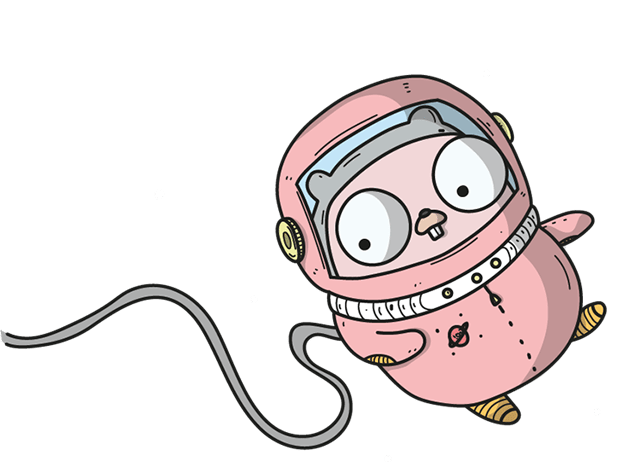

# GoTalk
<hr>


[](https://shields.io/)


A simple template to build a discord bot with ChatGPT, GPT3, DALL·E 2, and whisper wrapper.
i use [discordgo](https://github.com/bwmarrin/discordgo) as my main discord bot and [go-openai](https://github.com/sashabaranov/go-openai) for the simple lightweight openAI wrapper.

### Table of Content
- [GoTalk](#gotalk)
    + [Table of Content](#table-of-content)
    * [Link](#link)
    * [Getting Started](#getting-started)
    * [ToDo](#todo)

## Link

| No  |                                Name                                | Description                                                                                                                                                                                                                                                |
|:----|:------------------------------------------------------------------:|:-----------------------------------------------------------------------------------------------------------------------------------------------------------------------------------------------------------------------------------------------------------|
| 1   | [Discord Bot API Token](https://discord.com/developers/docs/intro) | this API is needed to identify and run the discord bot using [discordgo](https://github.com/bwmarrin/discordgo)                                                                                                                                            |
| 2   |  [OpenAI API Token](https://platform.openai.com/docs/quickstart)   | this one is use for accessing OpenAI API such as Dall-E, GPT3, Whisper, and the famous ChatGPT                                                                                                                                                             |
| 3   |                [Golang](https://go.dev/doc/install)                | Go is a language used in this project, Go is an open source programming language designed for building simple, fast, and reliable software. [Learn Golang EN](https://gobyexample.com/), [Learn Golang ID](https://dasarpemrogramangolang.novalagung.com/) |
## Getting Started
in this tutorial, i will expect you to understand at least basic syntax, configuration and such. If you have not learn golang before, please learn it, i already given a link to learn golang in [Link](#link) section number 3.
this is a rather easy one to install, you need to clone, fill your `OPENAI_TOKEN` and `DISCORD_BOT_TOKEN`, refer to [Link](#link) number 1, and 2.


[R.T.F.M](https://en.wikipedia.org/wiki/RTFM) before ask

<details>

<summary>Please follow this step</summary>

first clone this repo
```exec
git clone https://github.com/peacefulhack/openAI-discord-bot-golang.git
cd openAI-discord-bot-golang
```
in that folder, you will need to create .env file with this inside
```dotenv
OPENAI_TOKEN=<<<YOUR_OPENAI_TOKEN>>>
DISCORD_BOT_TOKEN=<<<YOUR_DISCORD_TOKEN>>>
```
after all configuration is done, run tidy to ensure all package is installed in your machine.
```bash
go mod tidy
```
and you're done, all you need is run the bot
```bash
go run main.go
```
</details>

## ToDo
- ~~add support ChatGPT~~
- ~~make update to support GPT3~~
- ~~make update to support GPT3.5~~
- make update to support whisper
- make update to support Dall-E 2 (*no public API yet*)